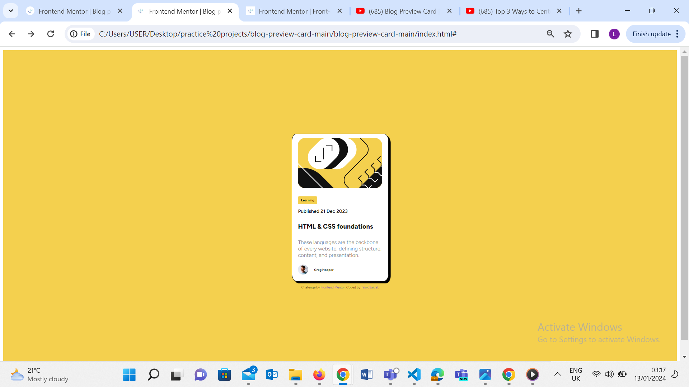
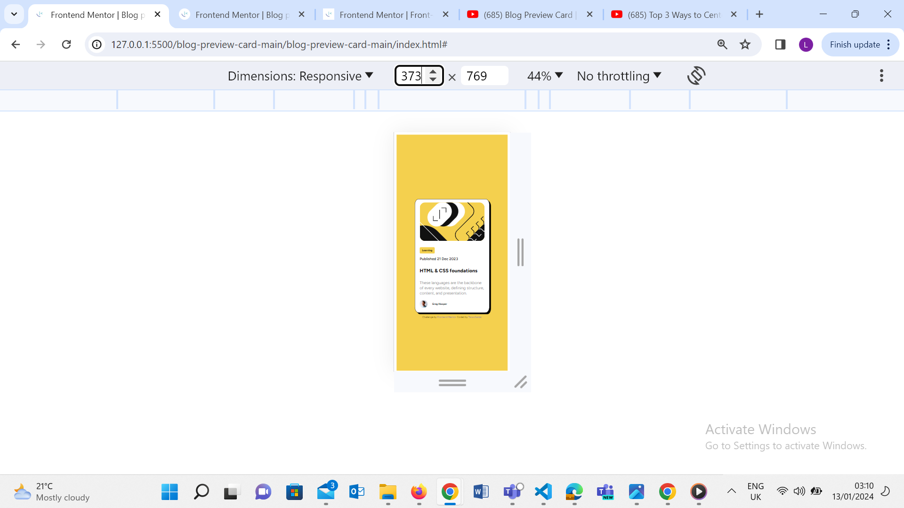

# Frontend Mentor - Blog preview card solution

This is a solution to the [Blog preview card challenge on Frontend Mentor](https://www.frontendmentor.io/challenges/blog-preview-card-ckPaj01IcS). Frontend Mentor challenges help you improve your coding skills by building realistic projects. 

## Table of contents

- [Overview](#overview)
  - [The challenge](#the-challenge)
  - [Screenshot](#screenshot)
  - [Links](#links)
- [My process](#my-process)
  - [Built with](#built-with)
  - [What I learned](#what-i-learned)
  - [Continued development](#continued-development)
  - [Useful resources](#useful-resources)
- [Author](#author)

## Overview

### The challenge

Users should be able to:

- See hover and focus states for all interactive elements on the page

### Screenshot




### Links

<!-- - Solution URL: [Add solution URL here](https://your-solution-url.com) -->
- Live Site URL: [Add live site URL here](http://127.0.0.1:5500/blog-preview-card-main/blog-preview-card-main/index.html)

## My process

### Built with

- Semantic HTML5 markup
- CSS custom properties
- Flexbox
- Mobile-first workflow

### What I learned

How to properly center a div.
```css
body{
    display: flex;
    flex-direction: column;
    align-items: center;
    justify-content: center;
}
```

How to make use of height and width to make website responsive.
```css
.cardTag{
    width: 3rem;
    height: 20px;
 }
```

How to reduce @media query to the barest minimum.

How to use camel case naming conventions.
```html
<div class="cardPublishedDate">Published 21 Dec 2023</div>
```
```css
.cardPublishedDate{
      font-size: 12px;
      font-weight: var(--font-weight-md);
      margin-top: 10px;
 }
```

How to use custom variables

```css
:root{
    --clr-primary: hsl(47, 88%, 63%);
    --clr-secondary:hsl(0, 0%, 100%);
    --clr-text-paragraph:hsl(0, 0%, 50%);
    --clr-text: hsl(0, 0%, 7%);

    --font-family-primary: "Figtree", sans-serif;
    
    --font-size-lg:30px;
    --font-size-md:16px;
    --font-size-sm:8px;

    --font-weight-lg:800;
    --font-weight-md:600;
    --font-weight-sm:300;
}
 ```

### Continued development

Media Query
Responsive web design
Mobile first workflow

### Useful resources

- [Example resource 1](https://coryrylan.com/blog/how-to-center-in-css-with-css-grid) - This helped me with centering div

- [Example resource 2](https://www.shecodes.io/athena/17496-how-to-remove-the-underline-of-a-link-in-css) - This is an amazing article which helped me finally understand how to remove text decoration. I'd recommend it to anyone still learning this concept.

## Author

<!-- - Website - [Add your name here](https://www.your-site.com) -->
- Frontend Mentor - [@TaiwoSaidat](https://www.frontendmentor.io/profile/TaiwoSaidat)
<!-- - Twitter - [@yourusername](https://www.twitter.com/yourusername) -->